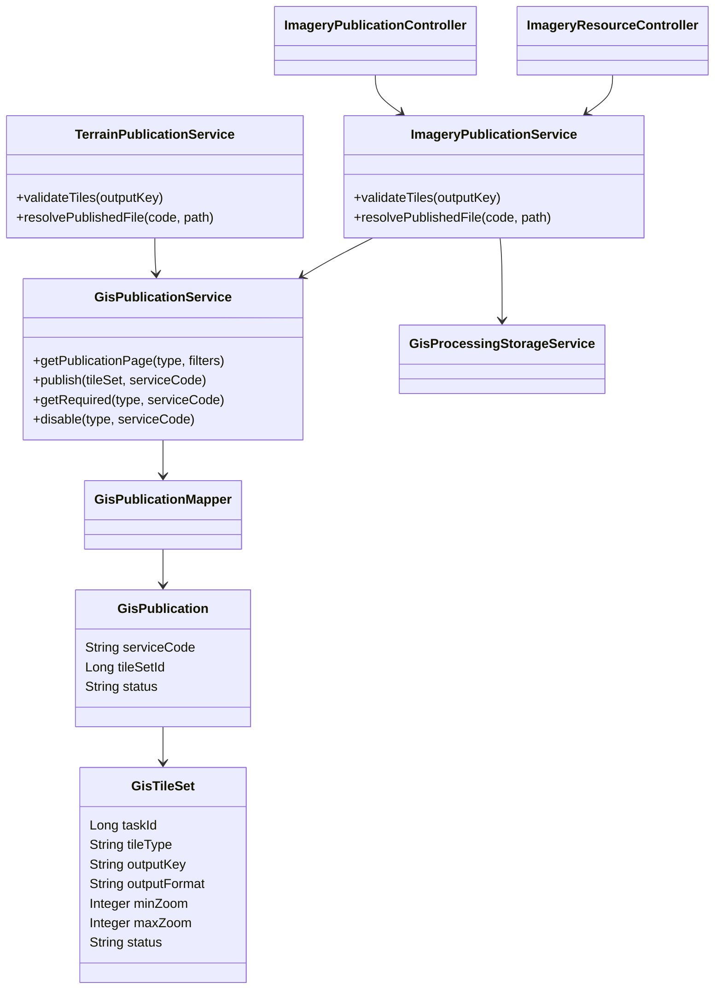
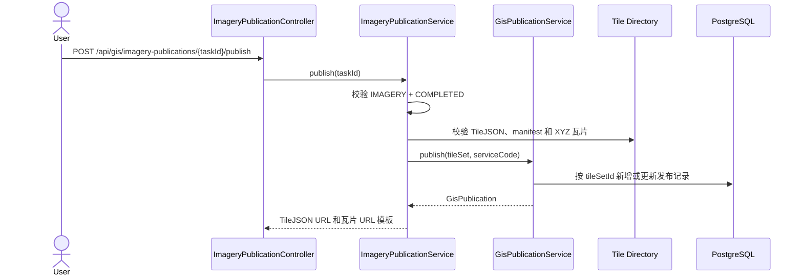

# 影像瓦片发布设计

## 设计目标

影像与地形共用发布记录和状态流转；发布记录直接关联静态瓦片集，不创建额外任务。各类型服务保留独立的产物校验、公开 URL 和资源 MIME 处理。影像数据面只暴露已发布的 TileJSON 和 XYZ PNG/JPEG 文件。

## 类图

## 发布时序

## 接口与状态

- 管理面：`/api/gis/imagery-publications`
- 数据面：`/imagery/{serviceCode}/tilejson.json`、`/imagery/{serviceCode}/{z}/{x}/{y}.{png|jpg}`
- `POST .../{sourceTaskId}/publish` 同时承担首次发布和重新启用。
- `PUT .../{serviceCode}/disable` 停用公开访问，但不删除切片产物。
- 状态仅允许 `PUBLISHED`、`DISABLED`。
- 服务编码使用 `TRN_`、`IMG_` 前缀；数据面按处理类型隔离。

## 安全约束

- 只允许发布 `COMPLETED` 的 `IMAGERY` 切片任务。
- `output_key` 必须位于 `imagery/` 命名空间。
- 发布前校验 `tilejson.json`、`manifest.json`、格式、层级和至少一张瓦片。
- 公开资源仅允许 TileJSON 和符合已发布格式、层级范围的 XYZ 路径。
- 所有文件路径必须规范化并保持在任务瓦片根目录内。
